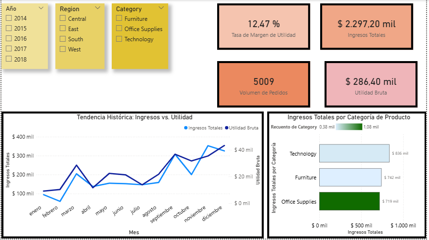
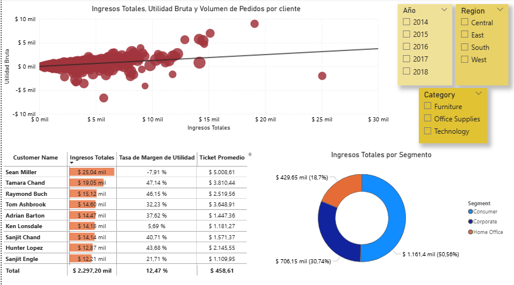
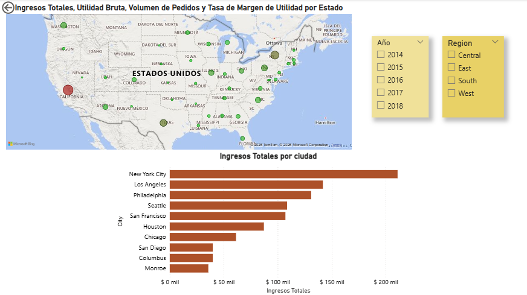

# Informes Estadísticos de Segmentos de Ventas (E-Commerce)

## Descripción del Proyecto
Este repositorio presenta un análisis integral de datos transaccionales de una "Superstore" de E-Commerce, desarrollado en **Power BI**. El proyecto transforma datos crudos en una herramienta de diagnóstico estratégico, permitiendo identificar patrones de consumo, rentabilidad crítica por cliente y eficiencia operativa geográfica.

El informe se estructura en tres niveles de profundidad:
1. **Desempeño Ejecutivo:** Monitoreo de KPIs financieros (Ingresos, Margen, Utilidad).
2. **Segmentación de Clientes:** Identificación de perfiles de valor mediante análisis de dispersión.
3. **Análisis Geográfico:** Localización de focos de ingresos y áreas de riesgo de rentabilidad.

## Vista Previa

| Dashboard de Desempeño | Análisis de Clientes | Distribución Geográfica |
| :---: | :---: | :---: |
|  |  |  |

---

##  Stack Técnico y Metodología

### 1. Preparación y Modelado (ETL)
* **Limpieza de Datos:** Estandarización de categorías y georreferenciación de ubicaciones para Bing Maps.
* **Esquema en Estrella:** Arquitectura de datos optimizada vinculando la tabla de hechos con dimensiones de Tiempo, Geografía, Clientes y Productos.

### 2. Análisis Estadístico y DAX
Se diseñaron medidas para obtener una visión real del negocio:
* **Eficiencia Financiera:** Medida `Tasa de Margen de Utilidad` ($12.47\%$ global), clave para entender la salud operativa más allá del volumen de ventas.
* **Métricas de Ticket:** Cálculo de `Ticket Promedio` ($458.61$) para medir el valor por transacción.
* **Ranking Dinámico:** Uso de filtros **Top N** para visualizar las ciudades con mayor impacto en la facturación.

### 3. Visualización y UX
* **Análisis de Outliers:** Gráfico de dispersión para detectar anomalías de rentabilidad.
* **Sincronización de Filtros:** Navegación fluida mediante segmentadores de Año, Región y Categoría que mantienen el contexto en todas las hojas.
* **Formato Condicional:** Barras de datos en tablas y mapas de burbujas con saturación de color basada en margen.

---

##  Hallazgos Clave (Insights)

* **Anomalías de Rentabilidad:** El análisis de clientes identificó casos críticos como *Sean Miller*, quien posee el mayor volumen de ingresos ($25.04k$) pero con un margen negativo del $-7.91\%$, señalando una ineficiencia en costos o descuentos excesivos.
* **Liderazgo de Categoría:** El segmento de **Technology** domina los ingresos totales con un acumulado de $836k$, seguido de cerca por Furniture.
* **Concentración Geográfica:** **New York City** se consolida como la ciudad líder en ventas (superando los $200k$), mientras que el mapa revela que el estado de **California**, a pesar de su alto volumen, presenta puntos de atención por márgenes reducidos (coloración roja).
* **Segmento de Mercado:** El sector **Consumer** representa la mayor parte de la torta de ingresos con un $50.56\%$.

---

## Contenido del Repositorio
* `ECommerce_Superstore_Analytics.pbix`: Archivo principal del reporte.
* `Screenshots/`: Capturas de pantalla de los tres tableros principales.
* `README.md`: Documentación detallada del proyecto.

## Cómo utilizar este proyecto
1. Descarga el archivo `.pbix` de este repositorio.
2. Ábrelo con **Power BI Desktop**.
3. Explora la interactividad haciendo clic en los puntos del mapa o filtrando por las categorías en el panel lateral.

---

## Fuente de datos
El dataset utilizado es el Sample - Superstore obtenido de Kaggle para fines de entrenamiento en análisis de datos.

---
**Autor:** Rocío Giuzio  
**Perfil:** Analista de Datos / Data Scientist
